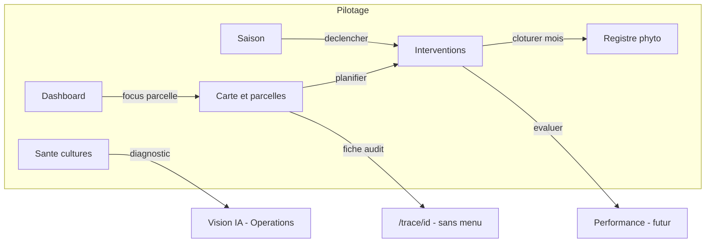

# Audit navigation — Section Pilotage (LeadFarm)

> **Date :** 2026-05-31  
> **Périmètre :** Sidebar → groupe **Pilotage** + pages connexes hors menu  
> **Source :** `src/lib/rbac/navigation.ts`, pages `src/app/*`, architecture cible (`leadfarm-architecture.md` §9)

---

## 1. Structure actuelle de la sidebar

La sidebar est organisée en **3 groupes** (dock + flyout) :

| Groupe | Id | Pages |
|--------|-----|-------|
| **Pilotage** | `pilotage` | 8 entrées (voir §2) |
| **Opérations** | `operations` | 9 entrées (micro-zones, météo, stock, produits, fournisseurs, IoT live, satellite, vision IA, fertigation) |
| **Audit** | `audit` | 5 entrées (conformité LMR, journal SCD2, opérateurs, rapports, admin rôles) |

Hors flyout : recherche (⌘K), alertes (panneau), paramètres / déconnexion.

---

## 2. Section Pilotage — rôle de chaque page

### 2.1 Tableau de bord — `/dashboard`

**Rôle :** Vue synthétique du domaine, orientée **action immédiate**.

| Fonction | Détail |
|----------|--------|
| Carte embarquée | Mini-carte avec parcelles et traitements ; sélection d’un traitement → focus parcelle |
| KPIs | Surface traitée, traitements du mois, validations en attente (rafraîchissement 60 s) |
| Panneau traitements | 5 derniers traitements, lien vers `/treatments` |
| Météo applicative | Overlay météo sur la carte (couches OpenWeather) — **pas** la page `/meteo` |
| CTA | « Planifier un traitement » → `/treatments` |

**Utilisateur cible :** directeur, agronome — « Qu’est-ce qui se passe aujourd’hui sur le domaine ? »

---

### 2.2 Carte & Parcelles — `/parcelles`

**Rôle :** **Hub géographique principal** — gestion et exploration des parcelles.

| Fonction | Détail |
|----------|--------|
| Carte Leaflet | Affichage, dessin polygones, sous-parcelles, GPS |
| CRUD parcelles | Création, édition, suppression, couleurs, cultures |
| Fiche parcelle | Culture, localisation, traitements, observations |
| Historique modal | `HistoriqueModal` — timeline traitements sur la parcelle sélectionnée |
| Mode théâtre | Exploration spatiale plein écran, geo-notes (maladies, irrigation, mauvaises herbes) |
| Liens | Vers `/trace/{id}`, planification traitement inline |
| Deep link | `?select={parcelle_id}` (utilisé par micro-zones, maladies) |

**Utilisateur cible :** agronome, opérateur — « Où est quoi, et qu’est-ce qu’on a fait sur cette zone ? »

---

### 2.3 Traitements — `/treatments`

**Rôle :** **Workflow opérationnel** des interventions phytosanitaires.

| Fonction | Détail |
|----------|--------|
| Liste filtrable | Statuts : brouillon → évalué (9 états) |
| Cycle de vie | Soumettre, approuver, démarrer, clôturer, évaluer |
| Planification | Modal `PlanifierTraitementModal`, édition, suppression |
| Détail traitement | Produits, opérateur, parcelle, trajectoire GPS (traitements terminés) |
| PDF ordre | FOR.PR6.003 par traitement (API + fallback client) |
| **PDF registre** | Export mensuel FOR.PR6.004 **depuis cette page aussi** |
| Carte live | `TractorLiveMap` pour suivi en cours |
| Liens | Vers `/trace` (GitBranch) |

**Utilisateur cible :** agronome, opérateur, magasinier (consultation) — « Planifier, exécuter, valider les traitements. »

---

### 2.4 Registre & PDF — `/registre`

**Rôle :** **Conformité réglementaire** — registre mensuel phyto (FOR.PR6.004).

| Fonction | Détail |
|----------|--------|
| Vue mensuelle | Filtre année / mois, compteurs par mois |
| Tableau registre | Date, parcelle, cible, produits, DAR, dose, opérateur, matériel |
| KPIs mois | ha traités, parcelles, opérateurs uniques |
| Export PDF | `genererRegistreMensuelPDF` — document officiel téléchargeable |

**Utilisateur cible :** directeur, auditeur — « Produire le registre légal du mois. »

---

### 2.5 Traçabilité — `/trace` + `/trace/[id]`

**Rôle :** **Fiche parcelle orientée audit** — fil complet parcelle → interventions.

| Route | Fonction |
|-------|----------|
| `/trace` | Landing : liste des parcelles → choix |
| `/trace/[id]` | Identité parcelle (zone, sol, irrigation, densité) |
| | Section plantation (culture, variété, date) |
| | Stats interventions (total, terminées, en cours, planifiées) |
| | Timeline chronologique des traitements |

**Utilisateur cible :** auditeur, directeur, client final (traçabilité) — « Montrer l’historique complet d’une parcelle. »

---

### 2.6 Campagnes — `/campagnes`

**Rôle :** **Saisons agricoles** — référentiel temporel lié aux plantations.

| Fonction | Détail |
|----------|--------|
| Liste campagnes | Nom, dates début/fin, statut (API `/api/v1/campagnes`) |
| Lecture seule | Pas de création UI (message API/SQL) |
| Lien demo | Bouton vers `/simulation` (hors menu principal) |

**Utilisateur cible :** agronome, directeur — « Quelle campagne est active ? »

---

### 2.7 Protocoles — `/protocoles`

**Rôle :** **Itinéraires techniques** agronomiques (référentiel MCD).

| Fonction | Détail |
|----------|--------|
| Liste protocoles | Nom, culture, variété, actif/inactif |
| Étapes J+n | Actions planifiées (type_action, type_evenement_code) |
| Source | API `/api/v1/protocoles` |

**Utilisateur cible :** agronome — « Quel est le plan technique pour cette culture ? »

---

### 2.8 Maladies — `/maladies`

**Rôle :** **Référentiel pathogènes + observations terrain**.

| Fonction | Détail |
|----------|--------|
| Référentiel | Catalogue maladies (type pathogène, cultures cibles) |
| Événements | Observations récentes (sévérité, parcelle, date, source) |
| Liens | Localiser sur `/parcelles?select=…`, CTA vers `/vision` (Diagnostic IA) |

**Utilisateur cible :** agronome — « Quelles maladies sont répertoriées et où les observe-t-on ? »

---

## 3. Pages connexes **hors** menu Pilotage (mais liées)

Ces routes existent dans le code mais **ne sont pas** dans le flyout Pilotage — certaines absentes de toute la sidebar.

| Route | Rôle | Dans sidebar ? | RBAC |
|-------|------|----------------|------|
| `/cartographie` | Carte PostGIS : parcelles, détections maladies, interventions en cours, GPS | ❌ Non | ❌ Non protégée |
| `/planning` | Plans consultant (annuel/trimestriel) + planning opérationnel (validation météo/stock) | ❌ Non | ❌ Non protégée |
| `/simulation` | Demo end-to-end (parcelle → campagne → traitement → alerte → traçabilité) | ❌ Non (lien depuis campagnes) | ✅ `simulation` |
| `/recoltes` | Récoltes + P&L par campagne | ❌ Non | ✅ `recoltes` |
| `/resultats` | Efficacité post-traitement, agrégats IoT, décisions IA | ❌ Non | ✅ `resultats` |
| `/meteo` | Météo par zone (Opérations) | Opérations | ✅ `meteo` |
| `/micro-zones` | Subdivision parcelle (humidité, stress, CE) | Opérations | ✅ `micro_zones` |
| `/vision` | Diagnostic IA foliaire | Opérations | ✅ `vision` |

---

## 4. Redondances et chevauchements identifiés

### 4.1 Critiques (même information, deux pages)

| Zone A | Zone B | Chevauchement |
|--------|--------|---------------|
| **Registre** `/registre` | **Traitements** `/treatments` | Export PDF FOR.PR6.004 mensuel disponible **sur les deux pages** (même utilitaire `genererRegistreMensuelPDF`) |
| **Traçabilité** `/trace/[id]` | **Parcelles** `/parcelles` | Historique traitements + identité parcelle ; parcelles a un modal historique **et** des liens vers `/trace/{id}` |
| **Dashboard** carte + traitements | **Parcelles** carte + traitements | Deux cartes Leaflet distinctes (`DashboardMap` vs carte parcelles) avec focus traitement/parcelle |
| **Cartographie** `/cartographie` | **Parcelles** `/parcelles` | Deux cartes parcelles ; cartographie ajoute détections et GPS — **page orpheline** non référencée dans la nav |
| **Maladies** observations | **Vision** `/vision` | Même fil maladie (maladies → vision ; cartographie affiche aussi les détections) |
| **Dashboard** overlay météo | **Météo zones** `/meteo` | Conditions applicatives vs météo par zone — concepts proches, UX séparée |

### 4.2 Modérées (même domaine métier, rôles différents mais confus)

| Pages | Problème |
|-------|----------|
| **Campagnes** + **Protocoles** + **Planning** | Trois niveaux de « plan » : saison (campagne), itinéraire technique (protocole), calendrier opérationnel (planning) — **planning absent du menu** |
| **Traitements** + **Planning** | Interventions planifiées vs `planning_operationnel` — risque de double saisie |
| **Micro-zones** (Opérations) + **Parcelles** | Subdivision affichée à part ; lien retour vers parcelles seulement |
| **Trace landing** `/trace` | Écran intermédiaire = simple liste parcelles → **doublon** du sélecteur déjà présent sur `/parcelles` |

### 4.3 Techniques (pas redondance métier, mais dette UX)

| Problème | Détail |
|----------|--------|
| **3 implémentations carte** | `DashboardMap`, carte `/parcelles`, `CartographieMap` |
| **Icônes dupliquées** | `MapIcon` : parcelles + micro-zones ; `BookOpen` : registre + protocoles ; `ScanEye` : maladies + vision |
| **Pages sans RBAC** | `/cartographie`, `/planning` absentes de `ROUTE_FEATURES` |
| **Architecture cible vs réel** | Doc prévoit `/carte`, `/exploitation/*`, `/operations/*` — as-built éparpillé sur 20+ routes plates |
| **Campagnes → Simulation** | Lien vers outil demo/dev dans une page métier |

### 4.4 Matrice de contenu dupliqué

```
                    │ Parcelles │ Dashboard │ Trace │ Treatments │ Registre │ Cartographie │
────────────────────┼───────────┼───────────┼───────┼────────────┼──────────┼──────────────│
Carte parcelles     │     ●     │     ●     │       │     ○      │          │      ●       │
Historique trait.   │     ●     │     ○     │   ●   │     ●      │     ○    │              │
Export registre PDF │           │           │       │     ●      │     ●    │              │
Fiche parcelle      │     ●     │           │   ●   │            │          │      ○       │
Détections maladie  │     ○     │           │       │            │          │      ●       │
Météo               │           │     ●     │       │            │          │              │

● = fonction principale   ○ = fonction secondaire / partielle
```

---

## 5. Proposition de réorganisation

### 5.1 Principe directeur

Regrouper par **intention utilisateur**, pas par entité MCD :

1. **Vue domaine** — synthèse + carte légère  
2. **Terrain** — parcelles, micro-zones, cartographie unifiée  
3. **Interventions** — planifier → exécuter → registre  
4. **Saison & agronomie** — campagnes, protocoles, maladies  
5. **Résultats** — récoltes, efficacité, traçabilité publique  

---

### 5.2 Structure sidebar proposée — groupe **Pilotage** (6 entrées au lieu de 8)

| # | Label proposé | Route | Regroupe |
|---|---------------|-------|----------|
| 1 | **Tableau de bord** | `/dashboard` | Inchangé — garder carte légère + KPIs, **retirer** la duplication météo profonde (lien vers météo) |
| 2 | **Carte & parcelles** | `/parcelles` | Fusion conceptuelle avec `/cartographie` — **une seule carte** avec onglets/couches (parcelles, détections, GPS, micro-zones) |
| 3 | **Interventions** | `/treatments` | Renommer « Traitements » ; absorber le flux planning opérationnel à terme |
| 4 | **Registre phyto** | `/registre` | **Seul** endroit pour export FOR.PR6.004 — retirer le bouton registre de `/treatments` |
| 5 | **Saison** | `/campagnes` | Hub : campagnes + protocoles + plantations (sous-onglets ou routes enfants) |
| 6 | **Santé des cultures** | `/maladies` | Maladies + lien fort vers Vision IA (ou onglet « Diagnostic ») |

**Retirer du menu Pilotage :**

| Page actuelle | Action |
|---------------|--------|
| **Traçabilité** `/trace` | Supprimer l’entrée sidebar ; accès via fiche parcelle (`/parcelles` → onglet Traçabilité) ou URL directe `/trace/[id]` pour audit/QR |
| **Protocoles** `/protocoles` | Déplacer sous **Saison** (`/campagnes/protocoles`) |

---

### 5.3 Pages orphelines — décision recommandée

| Page | Recommandation |
|------|----------------|
| `/cartographie` | **Fusionner** dans `/parcelles` (couches détections + GPS) puis **déprécier** la route |
| `/planning` | **Intégrer** dans `/treatments` (vue calendrier / kanban) ou sous `/campagnes/planning` ; ajouter RBAC |
| `/simulation` | Garder **hors menu** — accessible admin/dev uniquement (settings ou `/admin`) |
| `/recoltes` | Ajouter au Pilotage ou nouveau groupe **« Résultats »** : Récoltes + Efficacité |
| `/resultats` | Fusionner avec `/recoltes` → **« Performance »** (P&L + efficacité traitements + IoT) |

---

### 5.4 Flux utilisateur cible (simplifié)



---

### 5.5 Plan de migration par phases

#### Phase 1 — Quick wins (sans refonte UI)

- [ ] Retirer export registre PDF de `/treatments` (garder uniquement ordre FOR.PR6.003)
- [ ] Retirer entrée **Traçabilité** du flyout ; garder liens depuis parcelles
- [ ] Déplacer lien **Simulation** de `/campagnes` vers `/admin` ou le supprimer en prod
- [ ] Ajouter `/cartographie` et `/planning` au RBAC (`ROUTE_FEATURES`)
- [ ] Documenter dans la command palette : protocoles sous « Saison »

#### Phase 2 — Consolidation cartographique

- [ ] Unifier les 3 composants carte en un seul avec couches togglables
- [ ] Intégrer **micro-zones** comme couche ou panneau latéral de `/parcelles` (retirer entrée Opérations ou garder comme raccourci)
- [ ] Rediriger `/cartographie` → `/parcelles?view=layers`

#### Phase 3 — Regroupement métier

- [ ] `/campagnes` devient hub avec onglets : Campagnes | Protocoles | Planning
- [ ] `/trace` landing → redirect `/parcelles?panel=trace`
- [ ] Créer **Performance** (`/performance`) = `/recoltes` + `/resultats`

#### Phase 4 — Alignement architecture cible

Aligner avec `leadfarm-architecture.md` §9 :

| Cible doc | Route consolidée |
|-----------|------------------|
| `/carte` | `/parcelles` |
| `/exploitation/*` | `/campagnes/*` |
| `/operations/*` | `/treatments`, `/registre` |
| `/recoltes`, `/qr/[code]` | `/performance`, `/trace/[id]` (public) |

---

## 6. Synthèse exécutive

| Constat | Impact |
|---------|--------|
| **8 pages Pilotage** pour 4 intentions réelles (vue, terrain, interventions, conformité) | Navigation dense, choix difficile pour nouveaux utilisateurs |
| **Traçabilité** duplique parcelles + traitements | Entrée menu justifiable seule pour auditeurs ; sinon lien contextuel suffit |
| **Registre PDF** en double (traitements + registre) | Risque d’export incohérent ; un seul point de vérité |
| **3 cartes** + **cartographie orpheline** | Dette technique et confusion « quelle carte ouvrir ? » |
| **Planning, récoltes, résultats** existent mais invisibles | Fonctionnalités MCD complètes non accessibles depuis la nav |
| **Protocoles** séparé de **Campagnes** | Coupable conceptuellement (même fil « saison agricole ») |

**Recommandation principale :** passer de **8 entrées Pilotage** à **6 entrées** orientées tâches, fusionner les cartes, supprimer les exports dupliqués, et exposer récoltes/résultats via un hub **Performance**.

---

## 7. Annexe — mapping RBAC Pilotage actuel

| Route | Feature RBAC |
|-------|--------------|
| `/dashboard` | `dashboard` |
| `/parcelles` | `parcelles.view` |
| `/treatments` | `treatments.view` |
| `/registre` | `registre` |
| `/trace` | `trace` |
| `/campagnes` | `campagnes` |
| `/protocoles` | `protocoles` |
| `/maladies` | `maladies` |
