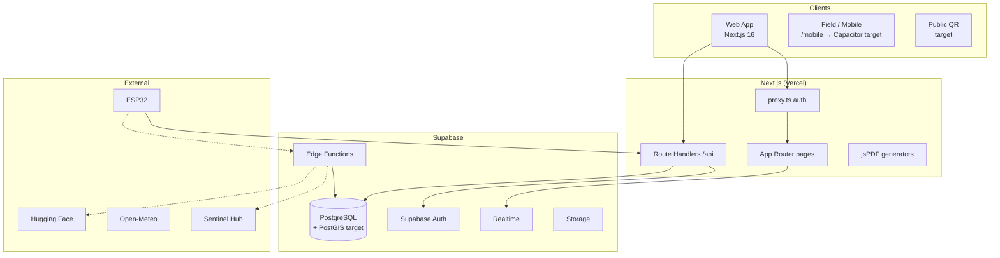

# LeadFarm — Technical Architecture

> Multi-tenant SaaS · SCD2 traceability · Edge-first IoT pipeline · Apple-inspired light-mode UI (target)

**Document version:** 2.1  
**Status:** Target architecture + honest as-built alignment (see §0)  
**Pilot client:** Domaine Khelifa (Sidi Bel Abbès) · Commercial intent: Groupe Lachhab — 50 units  
**Authors:** Akram Khelifa Mahdjoubi (CTO) · Hichem Bouamrane  
**Last updated:** 2026-05  
**Canonical application:** Next.js app at repository root (`src/`) — **not** `frontend/` or `server/` (deprecated per `README.md`)

---

## Table of Contents

0. [As-built vs target](#0-as-built-vs-target)
1. [Executive Summary](#1-executive-summary)
2. [Tech Stack](#2-tech-stack)
3. [Design System — Apple Light Mode](#3-design-system--apple-light-mode)
4. [High-Level Architecture](#4-high-level-architecture)
5. [Multi-Tenancy Model](#5-multi-tenancy-model)
6. [Database Architecture](#6-database-architecture)
7. [SCD2 Implementation](#7-scd2-implementation)
8. [User Profiles & RBAC Matrix](#8-user-profiles--rbac-matrix)
9. [Module Inventory](#9-module-inventory)
10. [Edge Functions](#10-edge-functions)
11. [Realtime Streams](#11-realtime-streams)
12. [Frontend Architecture](#12-frontend-architecture)
13. [Offline Strategy & Conflict Resolution](#13-offline-strategy--conflict-resolution)
14. [IoT Security — Per-Device Model](#14-iot-security--per-device-model)
15. [Folder Structure](#15-folder-structure)
16. [Performance & Observability](#16-performance--observability)
17. [Test Strategy](#17-test-strategy)
18. [Data Migration — Paper Records](#18-data-migration--paper-records)
19. [RGPD & Right-to-Erasure](#19-rgpd--right-to-erasure)
20. [Disaster Recovery (RTO / RPO)](#20-disaster-recovery-rto--rpo)
21. [Roadmap & Readiness](#21-roadmap--readiness)
22. [Deployment](#22-deployment)

---

## 0. As-built vs target

This document describes **where we are going** (target) and **what runs today** (as-built). Do not treat route names or stack rows marked *target* as shipped without checking §21.

### Canonical runtime

| Item | As-built (repo) | Target |
|------|-----------------|--------|
| Web app | **Next.js 16** App Router, `src/app/` | Same |
| Deprecated | `frontend/` (Vite), `server/` (Express) | Removed or archived |
| Auth gate | `src/proxy.ts` → `/login` if no session | + JWT custom claims via `auth-hook` |
| Primary data layer | `src/lib/data-provider.ts` + `hooks/useData.ts` | + TanStack Query, repositories, Server Actions |
| API | `src/app/api/**` Route Handlers | Same pattern; OpenAPI catalog |
| DB | Supabase PostgreSQL, migrations `001`–`015` | Single lineage + PostGIS everywhere |

### Schema lineages (must converge)

**ADR-15 implemented** in migration `016_adr15_canonical_parcelle.sql` + `src/lib/parcelles/` (apply migration on Supabase). Legacy migration families may still coexist on old DBs until `016` is applied:

| Lineage | Key tables | Consumed by |
|---------|------------|-------------|
| **A — Stock / English** | `regions`, `zones`, `sites`, `products`, `movements`, `treatments` | `fetchParcelles()`, stock, dashboard |
| **B — PPP / French** | `exploitations`, `parcelles`, `traitements`, `lots_stock`, `audit_log` | RLS, conformité, FOR.PR6 PDFs |
| **C — Master MCD** | `ZONE`, `PARCELLE`, `PLANTATION`, … (`008_*`) | Target domain; PostGIS |
| **D — Trace slice** | `campagnes`, `plantations` (`007`), `treatments.parcelle_id` | `/api/v1/trace`, `/trace` |

**Blocker:** UI parcelle IDs (lineage **A**) ≠ `parcelles` UUID (lineage **B/C**) → trace links and `parcelle_id` FKs fail unless unified.

### Edge & IoT (name mapping)

| Target name (doc) | Repo function / route | Status |
|-------------------|----------------------|--------|
| `ingest-mesure` | `supabase/functions/iot-ingestion` + `POST /api/readings` | Partial |
| `pull-satellite` | `supabase/functions/sentinel-cron` | Present |
| `detect-maladie-image` | `supabase/functions/detect-disease` | Present |
| `auth-hook` | `supabase/functions/auth-hook` | Present; wire to RLS |
| `pull-meteo`, `moteur-decision`, `envoyer-alerte`, `creer-lot-qr` | — | Planned |

---

## 1. Executive Summary

LeadFarm replaces paper-based phytosanitary record-keeping (FOR.PR6.003/004) with a real-time, audit-ready digital ecosystem for industrial-scale orchards.

**Target capabilities:**

- **SCD2 traceability** for GLOBALG.A.P. / HACCP / RGPD (version history, auditor timelines)
- **Edge-first IoT** (ESP32 → ingest → Realtime → live maps)
- **Role-aware access** (7 profiles, RLS + JWT claims)
- **PostGIS** parcel intelligence and treatment cartography
- **Apple light-mode UI** (premium operator + consumer QR)
- **Public QR traceability** for end-consumer provenance

**As-built today:** strong **stock + treatments + registre PDF** on lineage A/B; emerging **trace / campagnes / plantations / audit / satellite / vision** on lineage D; master MCD (C) and full SCD2 RPC layer still in progress.

---

## 2. Tech Stack

| Layer | Target | As-built (2026-05) | Notes |
|-------|--------|-------------------|--------|
| Framework | Next.js 15+ App Router, RSC, Server Actions | **Next.js 16**, mostly client pages | Migrate hot paths to RSC incrementally |
| Language | TypeScript 5 strict | TypeScript 5 | `database.types.ts` partial |
| UI | Tailwind 4 + shadcn (Apple tokens) | Tailwind 4 + custom **glass** theme | §3 migration in progress |
| Animation | Framer Motion | Framer Motion | In use |
| Auth + DB | Supabase PG 15 + PostGIS 3.3 | Supabase | PostGIS in `008`, not all UI paths |
| Realtime | Supabase Realtime | Enabled on treatments, telemetry | |
| Server logic | Edge Functions (Deno) | 5 functions in `supabase/functions/` | See §10 |
| Maps | MapLibre GL (primary) | **Leaflet** + react-leaflet | MapLibre planned for `/carte` |
| Server state | TanStack Query v5 | **`useData` hooks** | ADR-09 target |
| UI state | Zustand | React `useState` / local | |
| Forms | React Hook Form + Zod | Zod on **API routes**; mixed on forms | |
| Charts | Recharts (+ Visx) | **Recharts** | |
| PDF | jsPDF + pdf-lib (Edge) | **jsPDF** in `src/lib/pdf/` | pdf-lib planned |
| Mobile | Capacitor 6 | `/mobile` responsive page | APK not in repo root |
| Offline | Workbox + Dexie | **Not implemented** | §13 |
| AI | Hugging Face → self-hosted V2 | `detect-disease` function + `/vision` | |

> **Capacitor note:** benchmark MapLibre in WebView on mid-range Android before Lachhab APK; raster fallback for chauffeur layout if needed.

---

## 3. Design System — Apple Light Mode

**Target:** Apple-inspired light surfaces (`#f5f5f7` canvas, `#0071e3` CTA).  
**As-built:** `src/app/globals.css` — farm glass / dark-leaning theme on many screens. Legacy glass is **deprecated**, not removed everywhere.

### Surfaces (target tokens)

| Level | Token | Hex | Usage |
|-------|-------|-----|--------|
| 0 | `--surface-canvas-white` | `#f5f5f7` | Page background |
| 1 | `--surface-pure-white` | `#ffffff` | Cards, nav, modals |
| 2 | `--surface-lightest-gray-background` | `#e2e2e5` | Inputs, recessed sections |
| 3 | `--surface-pale-blue-overlay` | `#9fc6f4` | Consumer QR narrative |

### Domain accents

| Token | Hex | Usage |
|-------|-----|--------|
| `--color-leaf-green` | `#34c759` | OK / healthy |
| `--color-vibrant-orange` | `#ec893c` | Warning / harvest |
| `--color-deep-plum` | `#7424b5` | Audit / SCD2 |
| `--color-warm-taupe` | `#604630` | Soil / parcel |

### Density

`comfortable` default; `compact` class on stock and treatment data-entry screens.

---

## 4. High-Level Architecture



---

## 5. Multi-Tenancy Model

**Target:** shared Supabase project; `exploitation_id` on domain rows; RLS via `auth.jwt() ->> 'exploitation_id'`; custom claims from `auth-hook`.

**As-built:** `user_profiles.exploitation_id` (UUID) on French schema; `011_multi_tenancy_rbac.sql`; JWT hook **exists** — verify claims on staging before relying on them in RLS.

```sql
-- Target RLS template (INT master — align types in ADR-15)
CREATE POLICY tenant_isolation ON parcelle
  USING (identifiant_exploitation = (auth.jwt() ->> 'exploitation_id')::int);
```

**V2:** dedicated schema per large client (>500 ha) — same Auth, schema dispatch in middleware.

---

## 6. Database Architecture

### Target domain groups

| Group | Entities |
|-------|----------|
| Tenancy | `exploitation`, `utilisateur`, `role`, `permission` |
| Geo | `zone`, `parcelle`, `micro_zone` |
| Botany | `plantation`, `protocole`, `etape_protocole` |
| IoT | `capteur`, `capteur_device`, `type_mesure`, `mesure_iot` |
| Environment | `donnees_meteorologiques`, `donnees_satellite` |
| Operations | `evenement_agronomique`, `evenement_maladie`, `evenement_produit` |
| Output | `recolte`, `lot_qr` |
| Finance | `depense`, `revenu`, `resultat` |
| Intelligence | `decision`, `apprentissage`, `alerte` |

### PostGIS (target)

```sql
parcelle.geometrie      GEOMETRY(POLYGON, 4326);
micro_zone.geometrie    GEOMETRY(POLYGON, 4326);
evenement_agronomique.geometrie GEOMETRY(GEOMETRY, 4326);
-- CHECK: GeometryType IN ('POINT','POLYGON','MULTIPOLYGON')
```

**As-built:** `parcelles.geojson`, centroids, `regions` tree; full PostGIS in `008_new_master_schema.sql`.

### Indexing (target)

| Table | Index | Rationale |
|-------|-------|-----------|
| `mesure_iot` | `(capteur, horodatage DESC)` B-tree | Concurrent sensors break BRIN ordering (ADR-12) |
| `decision` | partial WHERE `statut = 'proposee'` | Expert queue |
| `lot_qr` | UNIQUE `code_qr` | Public lookup — format `LF-XXXXXX` base36 |

### QR format (target)

`LF-` + base36-encoded lot id → `https://app.leadfarm.app/qr/LF-K3T7X2`

---

## 7. SCD2 Implementation

### Versioned entities (target: 11)

`evenement_agronomique`, `evenement_maladie`, `evenement_produit`, `decision`, `protocole`, `etape_protocole`, `recolte`, `produit_phytosanitaire`, `parcelle`, `plantation`, `resultat`.

### Standard columns (target)

- `identifiant_metier` UUID (stable across versions)
- `numero_version`, `date_debut_validite`, `date_fin_validite`, `est_version_actuelle`
- `identifiant_modifie_par`, `motif_modification`

### Update path: RPC, not naive triggers (ADR-01)

Direct `UPDATE` on versioned tables is **forbidden**; apps call `update_<entity>_scd2(p_metier_id, p_new_data, …)` inside a transaction. Optional `BEFORE UPDATE` trigger raises if `app.scd2_internal` is not set.

**As-built:**

| Mechanism | Location | Maturity |
|-----------|----------|----------|
| `fn_scd2_versioning` / triggers | `012_scd2_standardization.sql` | Partial / review |
| `plantations` + `lineage_id` | `007` + PATCH in API | App-level close + insert |
| `audit_log` | `001_leadfarm` | Append JSON snapshots |
| UI | `/audit`, `/audit/[table]/[id]` | Read-oriented |

**Rule:** new SCD2 work must use **RPC + transaction**; migrate `plantations` PATCH to RPC before production audit.

### Current-version views (target)

```sql
CREATE VIEW vue_evenement_actuel AS
  SELECT * FROM evenement_agronomique WHERE est_version_actuelle = TRUE;
```

Frontend defaults to `vue_*_actuel`; audit module reads full history.

---

## 8. User Profiles & RBAC Matrix

| Profile | Code | Primary use |
|---------|------|-------------|
| Operator | `operator` | Events, treatments, harvests |
| Viewer | `viewer` | Read-only stakeholder |
| Expert | `expert` | Protocols, decisions |
| Chauffeur | `chauffeur` | Mobile capture, tasks |
| Stock Manager | `stock` | Inventory |
| Admin | `admin` | Full exploitation |
| Auditor | `auditor` | SCD2 history read |

**Target:** `role` + `permission` tables; JWT `role`, `exploitation_id`, `user_id` from `auth-hook`.  
**As-built:** `user_profiles.role` (French labels); **module guards in UI not fully enforced** — enforce in Route Handlers + RLS.

---

## 9. Module Inventory

Legend: ✅ shipped usable · 🔶 partial · 📋 planned · ❌ missing

| # | Module | Target route | As-built route | Status |
|---|--------|--------------|----------------|--------|
| 1 | Dashboard | `/dashboard` | `/dashboard` | ✅ |
| 2 | Carte | `/carte` | `/parcelles` (Leaflet) | 🔶 |
| 3 | Exploitation | `/exploitation/*` | `/campagnes`, `/trace` | 🔶 |
| 4 | Operations | `/operations/*` | `/treatments`, `/registre` | 🔶 |
| 5 | Vision | `/vision` | `/vision` | 🔶 |
| 6 | Stock | `/stock/*` | `/stock`, `/products`, `/suppliers` | ✅ |
| 7 | IoT Live | `/iot/live` | `/live` | ✅ |
| 8 | Capteurs | `/iot/capteurs` | — | 📋 |
| 9 | Météo | `/meteo` | — | 📋 |
| 10 | Satellite | `/satellite` | `/satellite` | 🔶 |
| 11 | Decisions | `/decisions` | — | 📋 |
| 12 | Protocoles | `/protocoles/*` | — | 📋 |
| 13 | Catalogues | `/catalogue/*` | `/products` (partial) | 🔶 |
| 14 | Récoltes / QR | `/recoltes`, `/qr/[code]` | — | 📋 |
| 15 | Finances | `/finances/*` | — | 📋 |
| 16 | Conformité | `/conformite` | `/conformite` | 🔶 |
| 17 | Audit SCD2 | `/audit/[entite]/[id]` | `/audit`, `/audit/[table]/[id]` | 🔶 |
| 18 | Alertes | `/alertes` | `/alerts` | 🔶 |
| 19 | Reports | `/reports` | `/reports` | 🔶 |
| 20 | Registre | `/registre` | `/registre` | ✅ |
| 21 | Chauffeur | `/(chauffeur)` | `/mobile` | 🔶 |
| 22 | Admin | `/admin/*` | `/settings`, `/operators` | 🔶 |

### API surface (as-built)

`/api/readings` · `/api/v1/{products,stock,movements,suppliers,treatments,operators,parcelles,stats,alerts,import}` · `/api/v1/trace/[id]` · `/api/v1/{campagnes,plantations}` (+ historique)

---

## 10. Edge Functions

| Target | Repo path | Status |
|--------|-----------|--------|
| `ingest-mesure` | `iot-ingestion` + `/api/readings` | 🔶 unify + per-device HMAC (§14) |
| `pull-satellite` | `sentinel-cron` | 🔶 |
| `detect-maladie-image` | `detect-disease` | 🔶 |
| `auth-hook` | `auth-hook` | 🔶 wire claims |
| `registre` automation | `registre-mensuel` | 🔶 |
| `pull-meteo` | — | 📋 |
| `moteur-decision` | — | 📋 |
| `envoyer-alerte` | — | 📋 |
| `generer-rapport` | — | 📋 |
| `creer-lot-qr` | — | 📋 |

**Rate limiting (target):** `check_device_rate_limit` RPC — max N inserts per device per window (§14).

---

## 11. Realtime Streams

| Channel (target) | As-built |
|------------------|----------|
| `iot:exploitation_<id>` | `esp32_telemetry`, `traitement_points` in publication |
| `alertes:user_<id>` | `alerts` table |
| `decisions:expert_<id>` | — |
| `chauffeur:tasks_<id>` | — |

Do not enable Realtime on raw SCD2 history tables — use current views only.

---

## 12. Frontend Architecture

### Target

| Page type | Strategy |
|-----------|----------|
| Dashboard, Carte | RSC + client islands |
| Forms | Server Actions + TanStack Query |
| Audit | RSC + Suspense per version |
| QR public | SSG + ISR 60s |
| Chauffeur | CSR + offline queue |

### As-built

| Pattern | Implementation |
|---------|----------------|
| Pages | Mostly `"use client"` + `AppLayout` |
| Data | `useData` → `data-provider` (Supabase or mock) |
| Auth | `proxy.ts` cookie session |
| Maps | Dynamic import Leaflet (no SSR) |
| PDF | Client trigger → API or local jsPDF |

**Migration path:** introduce TanStack Query per module; extract server reads for dashboard KPIs; keep mock fallback via `SUPABASE_CONFIGURED` flag.

---

## 13. Offline Strategy & Conflict Resolution

**Target:** Dexie `sync_queue` → Background Sync → Server Action; etag conflict detection; manual resolution for legally binding entities (`evenement_produit`, `recolte`).

| Entity | Policy |
|--------|--------|
| `mesure_iot` | Last-write-wins |
| `evenement_agronomique` | Field-level merge |
| `evenement_produit` | **Manual only** |
| Stock movements | Chronological replay |

**As-built:** not implemented. `sync_conflicts` table — planned (`012` family).

---

## 14. IoT Security — Per-Device Model

**Target:** `capteur_device` with `device_secret_hash` (bcrypt); HMAC per payload; admin revocation without fleet OTA.

**As-built:** shared ingest via `/api/readings`; `device_id` on `treatments` / `esp32_telemetry`; per-device table and revocation UI — **planned**.

---

## 15. Folder Structure

### Target layout (future)

Route groups `(dashboard)`, `(chauffeur)`, `exploitation/*`, `operations/*`, `lib/scd2`, `lib/offline` — see full tree in implementation tickets.

### As-built layout (repository root)

```
src/
├── app/                    # Pages + API (canonical)
│   ├── dashboard, parcelles, treatments, stock, …
│   ├── trace/, campagnes/, audit/, satellite/, vision/
│   ├── api/v1/, api/readings/
│   └── auth/callback/
├── components/             # layout, dashboard, map, treatments
├── hooks/useData.ts
├── lib/
│   ├── data-provider.ts    # Supabase + mock fallback
│   ├── supabase-server.ts   # Route Handler client
│   ├── pdf/
│   └── repositories/       # partial
├── proxy.ts
supabase/
├── migrations/001–015.sql
└── functions/              # 5 edge functions
scripts/esp32-leadfarm/     # firmware
frontend/                   # DEPRECATED Vite prototype
```

---

## 16. Performance & Observability

| Metric | Target |
|--------|--------|
| LCP dashboard | < 1.8s |
| TTI chauffeur 3G | < 4s |
| API p95 | < 250ms |
| Sensor → UI | < 500ms |

**Target stack:** Sentry, PostHog (EU), Supabase query advisor, `REFRESH MATERIALIZED VIEW CONCURRENTLY` for KPI MVs.

**As-built:** no formal budgets in CI yet.

---

## 17. Test Strategy

| Layer | Target |
|-------|--------|
| Unit | Vitest — conflict resolver, QR gen, HMAC |
| Integration | `supabase start` — SCD2 RPC, RLS role matrix |
| E2E | Playwright — 5 critical journeys on staging |

**As-built:** manual QA; CI typecheck + lint only — add Vitest/Playwright per §21.

---

## 18. Data Migration — Paper Records

Import FOR.PR6.003/004 history before Lachhab go-live via `scripts/migrate-paper-records.ts` (target): CSV → `insert_*_historique` RPC with `motif_modification = 'Migration FOR.PR6.003'`. Rejects → `migration_rejets`; fuzzy parcelle name match.

**As-built:** `scripts/import-excel.mjs`, `import-sql.mjs` for stock/movements — not full agronomic history.

---

## 19. RGPD & Right-to-Erasure

**Target:** `rgpd_effacer_utilisateur` procedure — pseudonymise SCD2 author refs; delete auth user; retain treatment records 5y (HACCP); audit log of erasure.

**As-built:** privacy not automated in app — legal review required before production multi-tenant.

---

## 20. Disaster Recovery (RTO / RPO)

| Scenario | RPO | RTO |
|----------|-----|-----|
| Accidental DELETE | 5 min | 30 min |
| Regional outage | 1 h | 4 h |

**Target:** Supabase PITR 7d; daily `pg_dump` → S3 EU; quarterly cold archive 5y. Runbook: `docs/runbooks/disaster-recovery.md` (create).

---

## 21. Roadmap & Readiness

### ✅ Produit — usable on staging / demo

- Stock, products, suppliers, movements, alerts (lineage A)
- Treatments, registre, treatment PDF (FOR.PR6)
- Dashboard, parcelles map (Leaflet), operators
- IoT live + `/api/readings`
- Login + `proxy.ts` auth
- Trace API + pages (requires parcelle ID alignment)
- Campagnes list API + page

### 🔨 En cours

- Parcelle canonical model (ADR-15)
- SCD2 RPC rollout beyond `plantations`
- `auth-hook` → JWT → RLS verification
- Satellite, vision, audit UI
- `treatments.parcelle_id` backfill
- Apple light token rollout

### 📋 Planifié V1

- MapLibre `/carte`, decisions, finances, QR public
- Offline Dexie + conflict UI
- Per-device IoT + revocation admin
- Paper history migration
- n8n / WhatsApp alerts
- E2E CI gate
- Production `app.leadfarm.app`

### V2 (post-pilot)

Drone (ADR-08), RTK guidance, tree-level AI, marketplace, hybrid tenancy.

---

## 22. Deployment

| Env | URL |
|-----|-----|
| local | `localhost:3000` + `supabase start` |
| preview | Vercel PR previews |
| staging | `staging.leadfarm.app` |
| production | `app.leadfarm.app` |

**CI/CD target:** typecheck, lint, unit, integration (`supabase start`), E2E on staging, `supabase db push` on `main`, Vercel production.

**Secrets:** Vercel public Supabase keys; Deno secrets for service role, HF, Sentinel, messaging providers.

---

## Appendix A — Architectural Decision Records

| # | Decision | Rationale |
|---|----------|-----------|
| ADR-01 | SCD2 via **RPC**, not same-table UPDATE triggers | Avoid recursion; explicit, testable versioning |
| ADR-02 | Shared multi-tenant DB (V1) | Ops + cost; RLS isolation |
| ADR-03 | Next.js App Router + Route Handlers (V1) | Shipping speed; Server Actions incremental |
| ADR-04 | MapLibre over Mapbox (target) | Open source, no per-tile fee |
| ADR-05 | Capacitor over RN (chauffeur) | Reuse web; benchmark WebView first |
| ADR-06 | HF Inference V1 | Low infra; self-host V2 |
| ADR-07 | Apple light UI (target) | Premium positioning |
| ADR-08 | Drone deferred V2 | No signed partner |
| ADR-09 | TanStack Query (target) | Mutations + cache |
| ADR-10 | Zod at API boundary | Shared validation |
| ADR-11 | `GEOMETRY(GEOMETRY)` on events | Point + polygon treatments |
| ADR-12 | B-tree not BRIN on IoT time | Concurrent inserts |
| ADR-13 | Per-device HMAC | Compromise isolation |
| ADR-14 | Entity-specific offline merge | Legal safety on PPP data |
| **ADR-15** | **Canonical `parcelle` UUID** | **Shipped:** `regions.id` = `parcelles.id`; `withAuth` on `/api/v1/*`; Vitest + CI |

---

## Appendix B — Glossary

- **SCD2** — Versioned rows with validity interval; current row flagged `est_version_actuelle`
- **RLS** — Postgres row-level security per tenant/user
- **MCD** — Modèle conceptuel de données (ER model)
- **FOR.PR6.003/004** — Algerian phytosanitary paper forms
- **AMM** — Market authorization for PPP products
- **PITR** — Point-in-time database recovery
- **As-built** — What is in `main` and deployed
- **Target** — Committed direction in this document

---

## 23. Couverture MCD v2 (app Next.js — migration 019)

| Couche | Entités | Statut app |
|--------|---------|------------|
| Multi-tenant | Auth, RLS API, RBAC UI | ✅ login, `withAuth`, `/admin` matrice rôles |
| Géo | ZONE/PARCELLE, MICRO_ZONE | ✅ `/parcelles`, `/micro-zones` |
| Météo / Satellite | DONNÉES_MÉTÉO, DONNÉES_SATELLITE | ✅ `/meteo`, `/satellite` + API |
| IoT | CAPTEUR, MESURE_IOT, MESURE_AGRÉGÉE | ✅ `/live`, `/resultats?scope=iot` |
| Agronomie | CAMPAGNE, PLANTATION, PROTOCOLE, TYPE_EVENEMENT | ✅ `/campagnes`, `/protocoles`, référentiel `type_evenement` |
| Maladies | MALADIE, EVENEMENT_MALADIE | ✅ `/maladies`, lien `/vision` |
| Finance | RÉCOLTE, REVENU, DEPENSE, P&L | ✅ `/recoltes` |
| IA | DECISION, DECISION_EVENEMENT, APPRENTISSAGE, RÉSULTAT | ✅ `/simulation`, `/resultats` |
| Traçabilité | EVENEMENT → `treatments` | ✅ existant + `parcelle_id` |

**Migration:** `supabase/migrations/019_mcd_complete_app_layer.sql`  
**Client données:** `src/lib/mcd/client.ts` (Supabase + mock)  
**APIs:** `/api/v1/micro-zones`, `meteo`, `satellite-data`, `maladies`, `protocoles`, `recoltes`, `resultats`, `admin/users`, `type-evenements`

---

**End of document — LeadFarm Technical Architecture v2.2**
