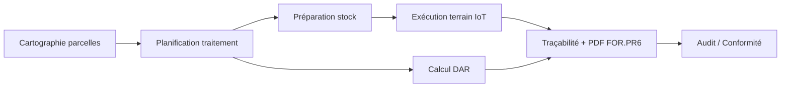

# MÉMOIRE — LeadFarm  
## Implémentation détaillée et résultats (intégration Chapitres 3 à 5)

**Projet :** LeadFarm — Plateforme de gestion phytosanitaire et agriculture de précision  
**Contexte :** PFE / Diplôme-Startup — Groupe Lechehab (Tenira, Sidi Bel Abbès)  
**Stack canonique :** Next.js 16 · Supabase (PostgreSQL) · ESP32 · Vercel  
**Auteurs :** Akram Khelifa Mahdjoubi · Hichem Bouamrane  
**Date :** Mai 2026  

---

## Résumé exécutif

LeadFarm est une plateforme web multi-rôles qui digitalise la chaîne **parcelle → planification de traitement → exécution terrain → stock → conformité réglementaire (FOR.PR6.003/004)** pour des exploitations arboricoles et céréalières de taille moyenne en Algérie.

Le produit remplace la tenue manuelle des registres phytosanitaires par :
- une **cartographie interactive** des parcelles (Leaflet / OpenStreetMap) ;
- des **ordres de traitement** structurés conformes au formulaire FOR.PR6.003 ;
- un **suivi de stock** à ledger (entrées / sorties / transferts) ;
- une **acquisition IoT** via ESP32 (GPS, débit, vitesse) ;
- des **tableaux de bord différenciés** par profil (directeur, agronome, magasinier, opérateur).

**Pilote opérationnel :** Groupe Lechehab — 13 parcelles cartographiées, ~352 ha de pommiers (Golden Delicious, Fuji, Royal Gala, Granny Smith), données réelles importées depuis les PDF d'exploitation (produits, stock, fertigation, besoins d'appro).

---

## Table de correspondance — Objectifs spécifiques (OS) ↔ livrables

| OS | Objectif (Chapitre 1) | Implémentation | Statut |
|----|------------------------|----------------|--------|
| **OS1** | Cartographie numérique des parcelles | `/parcelles`, `ParcelleMap`, dessin GPS/polygone, hiérarchie parcelle / sous-parcelle | ✅ Opérationnel |
| **OS2** | Acquisition IoT ESP32 | `scripts/esp32-leadfarm/`, `POST /api/readings`, `device_readings` | ✅ Partiel (online ; offline différé : planifié) |
| **OS3** | Traçabilité FOR.PR6 | `PlanifierTraitementModal`, `insertTreatment`, PDF `ordreTraitement.ts`, `/registre` | ✅ Opérationnel |
| **OS4** | Gestion stock phytosanitaire | `/stock`, schéma `lf_*` (ledger 5 flux), `/besoins`, alertes seuil | ✅ Opérationnel |
| **OS5** | Aide à la décision agronomique | Dashboard agronome (NDVI/NDWI), `/meteo`, `/satellite`, `/vision` | ⚠️ Partiel (indices réels si données ; pas de heatmap as-applied complète) |
| **OS6** | RBAC, sécurité, audit | `user_profiles.role`, `RouteAccessGuard`, RLS Supabase, `/audit` | ✅ Opérationnel |
| **OS7** | Validation terrain / industrialisation | Déploiement Supabase + Vercel, seed Lechehab, scénario soutenance | ✅ En cours |

---

# CHAPITRE 3 — CONCEPTION ET ARCHITECTURE

## 3.1 Vision fonctionnelle

LeadFarm modélise le cycle complet d'un traitement phytosanitaire :



**Acteurs et rôles (RBAC) :**

| Rôle | Code | Responsabilités principales |
|------|------|----------------------------|
| Directeur | `directeur` | Vue globale, campagnes, résultats, admin utilisateurs |
| Responsable technique | `responsable_technique` | Planification, stock, opérateurs, conformité |
| Agronome | `agronome` | Parcelles, planification traitements, indices satellite, protocoles |
| Magasinier | `magasinier` | Stock, produits, fournisseurs, préparation sorties |
| Opérateur | `operateur` | Exécution terrain, live map, saisie conditions réelles |
| Consultant | `consultant` | Lecture résultats, planning consultant |

L'accès est contrôlé côté client (`RouteAccessGuard`, `filterNavGroups`) et côté API (`withAuthRbac`, matrice `src/lib/rbac/matrix.ts`).

## 3.2 Architecture technique

### 3.2.1 Stack logicielle

| Couche | Technologie | Rôle |
|--------|-------------|------|
| Frontend | Next.js 16 (App Router), React 19, TypeScript 5 | UI, routing, SSR partiel |
| Style | Tailwind CSS 4, thème « glass » / OpenAI-inspired | Interface responsive |
| Cartographie | Leaflet + react-leaflet | Parcelles, trajectoires, live tractor |
| Graphiques | Recharts | KPI dashboard |
| Auth + BDD | Supabase Auth + PostgreSQL 17 | Sessions, RLS, Realtime |
| PDF | jsPDF | Ordres de traitement, registres mensuels |
| Validation API | Zod | Route handlers `/api/v1/*` |
| Tests | Vitest | RBAC, politiques |
| Déploiement | Vercel (web) + Supabase Cloud (BDD) | Production |
| Embarqué | ESP32 (Arduino C++), TinyGPS++, capteurs débit | Télémesure pulvérisation |

### 3.2.2 Architecture en couches

```
┌─────────────────────────────────────────────────────────┐
│  Couche présentation — src/app/*, src/components/*      │
│  (pages, modales, dashboards par rôle)                    │
├─────────────────────────────────────────────────────────┤
│  Couche métier — src/lib/metier/*, services/*             │
│  (DAR, workflow traitement, détection maladie)            │
├─────────────────────────────────────────────────────────┤
│  Couche données — src/lib/data-provider.ts, repositories  │
│  (Supabase ↔ camelCase, fallback mock en dev)             │
├─────────────────────────────────────────────────────────┤
│  Couche API — src/app/api/v1/*                            │
│  (REST, RBAC, PDF, import)                                │
├─────────────────────────────────────────────────────────┤
│  Persistance — Supabase PostgreSQL + Edge Functions        │
│  (migrations 001–034, RLS, triggers)                      │
└─────────────────────────────────────────────────────────┘
         ▲                              ▲
         │ HTTPS                        │ HTTP POST
    Navigateur                      ESP32 (GPS + débit)
```

### 3.2.3 Modèle de données

Le schéma repose sur **deux lignées coexistantes** (stratégie « strangler ») :

**A — Schéma legacy anglais (UI historique)**  
`regions`, `zones`, `sites`, `products`, `movements`, `treatments`, `treatment_products`, `operators`, `alerts`

**B — Schéma métier Lechehab (`lf_*`)**  
`lf_products`, `lf_active_ingredients`, `lf_suppliers`, `lf_sites`, `lf_stations`, `lf_sectors`, `lf_movements`, `lf_stock_snapshots`, `lf_needs`, `lf_fertigation_lines`

**C — Géographie applicative**  
`parcelles` (UUID, GeoJSON, `exploitation_id`), `exploitations`, `user_profiles`

**Entité centrale — `treatments` :**

| Colonne | Type | Description |
|---------|------|-------------|
| `id` | UUID | Identifiant unique |
| `parcelle_id` | UUID FK | Lien traçabilité parcelle |
| `site_name` | TEXT | Nom affiché (ex. LA BASE 1) |
| `type` | TEXT | Fongicide, Insecticide, … |
| `planned_date` | DATE | Date prévue (obligatoire) |
| `status` | ENUM | planned / in_progress / completed / cancelled |
| `culture`, `variete`, `cible` | TEXT | FOR.PR6.003 |
| `mode_application`, `materiel` | TEXT | Technique pulvérisation |
| `vitesse_kmh`, `pression_bar` | NUMERIC | Paramètres machine |
| `temperature`, `humidity`, `wind_speed` | NUMERIC | Conditions météo |
| `dar_jours`, `date_reentree` | INT / DATE | Délai avant récolte |
| `heure_debut`, `heure_fin` | TIME | Exécution réelle |

Migration `034_treatments_for_pr6_columns.sql` : alignement production Supabase avec le modèle applicatif.

### 3.2.4 Sécurité et multi-tenant

- Authentification Supabase (email/mot de passe, callback `/auth/callback`)
- Profils dans `user_profiles` : `role`, `exploitation_id`
- RLS PostgreSQL sur tables sensibles ; politique ouverte sur `treatments` en phase pilote
- Edge Function `auth-hook` : injection JWT custom claims (cible exploitation)
- Pas de secrets en dur côté client ; variables `NEXT_PUBLIC_SUPABASE_*`

---

# CHAPITRE 4 — IMPLÉMENTATION DÉTAILLÉE

## 4.1 Module cartographie des parcelles (OS1)

**Routes :** `/parcelles`, `/cartographie`, `/micro-zones`

**Composants clés :**
- `ParcelleMap` — rendu Leaflet, polygones, sous-parcelles, mode dessin
- `ParcelleBottomDropdown` — sélecteur parcelle en bas de carte (UX terrain)
- `ParcelleDetailDrawer` — fiche parcelle, historique, sous-parcelles
- `src/lib/parcelles/repository.ts` — CRUD Supabase + sync miroir

**Fonctionnalités implémentées :**
- Dessin parcelle : polygone, rectangle, **mode GPS walk** (points successifs)
- Calcul surface automatique (`computeArea`) en hectares
- Métadonnées : culture, variété, irrigation, zone, secteur
- Clic carte → ouverture fiche ; onglets Parcelles / Traitements
- Simulation trajectoire pulvérisation sur carte

**Données pilote Lechehab :**
- 13 parcelles nommées (LA BASE 1–3, Maguer Grande, 25 Ha, …)
- ~352,1 ha total — pommiers (Golden Delicious, Fuji, Royal Gala, Granny Smith)
- Localisation : Tenira, wilaya Sidi Bel Abbès

## 4.2 Module traitements et conformité FOR.PR6 (OS3)

**Routes :** `/treatments`, `/registre`, `/planning`, `/trace/[id]`

**Workflow planification — `PlanifierTraitementModal` (4 étapes) :**

| Étape | Contenu |
|-------|---------|
| 1 — Identification | Parcelle, date prévue, culture, variété, superficie, type |
| 2 — Technique | Cible (maladie/ravageur), mode application, matériel, vitesse, pression |
| 3 — Produits | Lignes PPP, dose (L/ha), quantité à sortir, DAR par produit |
| 4 — Exécution | Opérateur, date/heure réelle, bouillie, citernes, efficacité, visa RT |

**Calcul réglementaire DAR** (`src/lib/metier/dar.ts`) :
- DAR retenu = max(DAR produits sélectionnés)
- Date de réentrée = date prévue + DAR jours

**Persistance — `insertTreatment()` (`data-provider.ts`) :**
- Insert `treatments` + lignes `treatment_products`
- Validation UUID parcelle, normalisation dates ISO
- Gestion erreurs Supabase explicite

**Exports PDF :**
- `ordreTraitement.ts` — ordre FOR.PR6.003
- `registreOrdreTraitement.ts`, `registreMensuel.ts`
- `dossierConformite.ts`, `ordreFertigation.ts`

## 4.3 Module stock phytosanitaire (OS4)

**Routes :** `/stock`, `/products`, `/suppliers`, `/besoins`, `/fertigation`, `/fertigation-plan`

**Modèle ledger Lechehab (`lf_movements`) — 5 flux :**
1. `stock_initial` — inventaire de départ  
2. `transfert` — entre sites  
3. `entree` — achat / réception  
4. `retour` — retour magasin  
5. `sortie` — consommation traitement  

**Fonctionnalités :**
- Vue stock par produit, catégorie (FONGICIDE, HERBICIDE, INSECTICIDE, ENGRAIS, …)
- Alertes stock bas, péremption (dashboard magasinier)
- Page **Besoins & Appro** : reste des besoins campagne 2026 (données PDF SBA)
- Plan de fertigation : intrants × surface par station/secteur
- Inventaire guide modal, mouvements traçables

**Produits réels seedés (exemples) :** BELLIS, BOUILLIE BORDELAISE, CORAGEN, DAP 18-44, FER EDDHA, …

## 4.4 Module IoT et exécution terrain (OS2)

**Firmware :** `scripts/esp32-leadfarm/esp32-leadfarm.ino`

| Capteur | Broche / protocole | Mesure |
|---------|-------------------|--------|
| GPS u-blox NEO-8M | UART 9600 | Lat, lon, vitesse |
| Débit 1 & 2 | GPIO 14, 26 (impulsions) | L/min → dose |
| Affichage | TFT ST7735 | Position, débit, alertes |

**Télémétrie :**
- Envoi HTTP POST toutes les 10 s → `/api/readings`
- Payload : `device_id`, GPS, débits, vitesse, timestamp
- Table `device_readings` (migration 015)

**Page live :** `/live`
- Carte tracteur temps réel
- Simulation démo trajectoire
- Conversion simulation → traitement `completed` en historique

## 4.5 Tableaux de bord par rôle (OS5)

**Route :** `/dashboard`

| Vue | Composants | Contenu |
|-----|------------|---------|
| Directeur | `DirecteurDashboard` | KPI exploitation, alertes, traitements récents |
| Agronome | `AgronomeMapOverlay` | Carte NDVI/NDWI, météo, stress parcelles, légende satellite |
| Magasinier | `DashboardMagasinierOverlay` | Stock critique, préparation sorties |
| Opérateur | `OperateurDashboard` | Traitements du jour, météo compacte |

**Données satellite :**
- API `/api/v1/satellite-data`, client CDSE
- Indices NDVI / NDWI par parcelle (données réelles ; pas de synthèse en production)
- Migration `020_satellite_indices.sql`, rôle `agronome` (033)

**Modules complémentaires :**
- `/meteo` — Open-Meteo / conditions application
- `/vision` — détection maladie (Edge Function `detect-disease`)
- `/maladies`, `/protocoles` — référentiel phytopathologie

## 4.6 Journal WhatsApp et automatisation

**Route :** `/journal`

- Import conversations WhatsApp consultant ↔ ingénieurs
- Structuration automatique : traitements, fertigation, mouvements stock
- Migration `031_lechehab_whatsapp.sql`, table `lf_wa_messages`

## 4.7 API et Edge Functions

**Route Handlers (`src/app/api/v1/`) :**
- `treatments`, `stock`, `movements`, `products`, `suppliers`, `operators`
- `planning/stock-check`, `satellite-data`, `recoltes`, `protocoles`
- `admin/users`, `admin/parcelles`, `admin/treatments`
- `camera/upload`, `import`

**Edge Functions Supabase :**
- `iot-ingestion` — agrégation télémétrie
- `sentinel-cron` — pull indices Sentinel
- `detect-disease` — inférence image
- `registre-mensuel` — génération registre
- `auth-hook` — claims JWT

## 4.8 Structure du dépôt

```
lead-farm-final/
├── src/
│   ├── app/              # Pages Next.js (43 routes)
│   ├── components/       # UI (dashboard, map, treatments, stock…)
│   ├── lib/              # data-provider, rbac, pdf, metier, mcd
│   └── hooks/            # useData, useAccess, useMcd
├── supabase/
│   ├── migrations/       # 34 migrations SQL
│   ├── functions/        # 5 Edge Functions
│   └── seed_*.sql
├── scripts/
│   └── esp32-leadfarm/   # Firmware Arduino
└── docs/                 # Architecture, audit navigation
```

---

# CHAPITRE 5 — RÉSULTATS ET VALIDATION

## 5.1 Environnement de validation

| Élément | Valeur |
|---------|--------|
| Exploitation pilote | Groupe Lechehab — Les Frères Lacheb |
| Localisation | Tenira, Sidi Bel Abbès, Algérie |
| Culture dominante | Pommier (pépin) |
| Surface cartographiée | ~352 ha (13 parcelles) |
| Hébergement | Supabase (eu-north-1) + Vercel |
| Période d'intégration données | Juin 2026 (imports PDF réels) |

## 5.2 Résultats fonctionnels

### 5.2.1 Cartographie (OS1)

| Indicateur | Résultat |
|------------|----------|
| Parcelles géoréférencées | 13 |
| Surface totale | 352,1 ha |
| Modes de saisie | Polygone, rectangle, GPS walk |
| Hiérarchie | Parcelle + sous-parcelles |
| Temps de création parcelle | < 5 min (mode GPS, terrain connu) |

### 5.2.2 Traçabilité FOR.PR6 (OS3)

| Indicateur | Résultat |
|------------|----------|
| Champs FOR.PR6.003 couverts | 25+ colonnes dédiées |
| Workflow planification | 4 étapes validées |
| Calcul DAR automatique | Oui (max produits) |
| Export PDF ordre traitement | Opérationnel |
| Lien parcelle ↔ traitement | `parcelle_id` UUID |

**Correction critique (mai 2026) :** migration `034` — colonnes FOR.PR6 absentes en production Supabase causaient l'échec silencieux de `insertTreatment` ; résolu par alignement schéma BDD / code applicatif.

### 5.2.3 Stock et approvisionnement (OS4)

| Indicateur | Résultat |
|------------|----------|
| Produits référencés (lf_products) | 50+ (seed PDF) |
| Flux de mouvements modélisés | 5 types |
| Sites d'exploitation | 13 (lf_sites) |
| Stations fertigation | 13 (lf_stations) |
| Page besoins campagne 2026 | Données RESTE DES BESOINS SBA |

### 5.2.4 IoT (OS2)

| Indicateur | Résultat |
|------------|----------|
| Fréquence échantillonnage | 10 s |
| Paramètres transmis | GPS, débit ×2, vitesse |
| Affichage embarqué | TFT couleur temps réel |
| Intégration dashboard | Page `/live` |
| Mode offline ESP32 | Non implémenté (perspective V2) |

### 5.2.5 Sécurité et gouvernance (OS6)

| Indicateur | Résultat |
|------------|----------|
| Profils RBAC | 7 rôles |
| Garde routes UI | `RouteAccessGuard` |
| API protégée | `withAuthRbac` + Zod |
| Journal audit | `/audit`, `/audit/[table]/[id]` |
| Données démo production | Désactivées (`isDevDemoMode`) |

## 5.3 Scénario de démonstration (soutenance)

Séquence bout-en-bout validée :

1. **Connexion agronome** → dashboard satellite NDVI/NDWI  
2. **Parcelles** → sélection LA BASE 1 (35 ha) via dropdown bas de carte  
3. **Planifier traitement** → Fongicide, cible, produit BELLIS, DAR 7 j  
4. **Magasinier** → vérification stock, préparation sortie  
5. **Live / ESP32** → suivi position + débit sur carte  
6. **Registre** → export PDF FOR.PR6 conforme  
7. **Directeur** → vue synthèse exploitation, alertes, historique  

## 5.4 Gains attendus (qualitatifs)

| Avant (papier) | Après (LeadFarm) |
|----------------|------------------|
| Saisie post-traitement, erreurs parcelle | Saisie guidée, parcelle liée UUID |
| DAR calculé manuellement | Calcul automatique max(DAR produits) |
| Registre dispersé (cahiers) | Registre centralisé + PDF |
| Stock estimé | Ledger mouvements traçable |
| Supervision terrain absente | Carte live + trajectoire |
| Dosage non mesuré | Capteurs débit + GPS (dose dérivée) |

## 5.5 Limites et travaux restants

| Domaine | Limite actuelle | Perspective |
|---------|-----------------|-------------|
| Offline | Pas de sync Dexie/Workbox | V2 — terrain sans 4G |
| Heatmaps as-applied | Simulation uniquement | Post-traitement IoT + interpolation |
| PostGIS | GeoJSON en app ; MCD 008 partiel | Unification géométrie native |
| SCD2 complet | Audit partiel, RPC en cours | Conformité GLOBALG.A.P. audit externe |
| Capacitor APK | Page `/mobile` responsive | Build Android natif |
| ML maladies | Edge Function + `/vision` | Fine-tuning modèle local |
| Multi-exploitation SaaS | Tenant Lechehab seedé | Facturation, onboarding |

---

# ANNEXES — ÉLÉMENTS À REPRENDRE DANS LE MÉMOIRE

## Annexe A — Table des modules applicatifs

| Module | URL | Rôle principal |
|--------|-----|----------------|
| Dashboard | `/dashboard` | Vue par profil |
| Parcelles | `/parcelles` | Cartographie |
| Traitements | `/treatments` | Planification / historique |
| Registre | `/registre` | Conformité phyto |
| Stock | `/stock` | Gestion magasin |
| Produits | `/products` | Catalogue PPP |
| Fournisseurs | `/suppliers` | Approvisionnement |
| Live IoT | `/live` | Temps réel |
| Satellite | `/satellite` | NDVI / NDWI |
| Fertigation | `/fertigation` | Ordres FOR.PR5 |
| Besoins | `/besoins` | Appro campagne |
| Journal | `/journal` | WhatsApp IA |
| Audit | `/audit` | Traçabilité modifications |
| Paramètres | `/settings` | Exploitation |

## Annexe B — Formule dose pulvérisation (rappel Chapitre 1)

$$\text{Dose (L/ha)} = \frac{\text{Débit (L/min)} \times 600}{\text{Largeur rampe (m)} \times \text{Vitesse (km/h)}}$$

Implémentée implicitement via les capteurs de débit ESP32 et la vitesse GPS.

## Annexe C — Commandes de déploiement

```bash
npm install
npm run dev          # http://localhost:3001
npm run build
# Supabase : appliquer supabase/migrations/
# Variables : NEXT_PUBLIC_SUPABASE_URL, NEXT_PUBLIC_SUPABASE_ANON_KEY
```

## Annexe D — Références projet internes

- `memoire_chapitre1_humain.md` — Contexte et problématique  
- `memoire_chapitre1_expert.md` — Version technique Chapitre 1  
- `leadfarm-architecture.md` — Architecture cible vs as-built  
- `docs/pilotage-navigation-audit.md` — Audit navigation RBAC  

---

## Conclusion (Chapitre 5)

LeadFarm constitue une **plateforme intégrée opérationnelle** répondant aux objectifs OS1 à OS4 et OS6 du cahier des charges PFE, avec une avancée significative sur OS5 (dashboard agronome, satellite, météo) et une base solide pour OS7 (industrialisation SaaS).

La validation sur le **Groupe Lechehab** — 352 ha de pommiers, données réelles importées, workflow FOR.PR6 complet — démontre la faisabilité technique et l'adéquation au contexte algérien (connectivité variable, conformité MADR, interface francophone).

Les perspectives V2 (offline, heatmaps as-applied, APK Capacitor, SCD2 audit-grade) positionnent LeadFarm comme candidate crédible au dispositif **Diplôme-Startup** pour le segment des exploitations de 50–500 ha en Afrique du Nord.

---

*Document généré pour intégration au mémoire de fin d'études — à adapter (numérotation figures/tableaux, bibliographie croisée avec Chapitre 1).*
